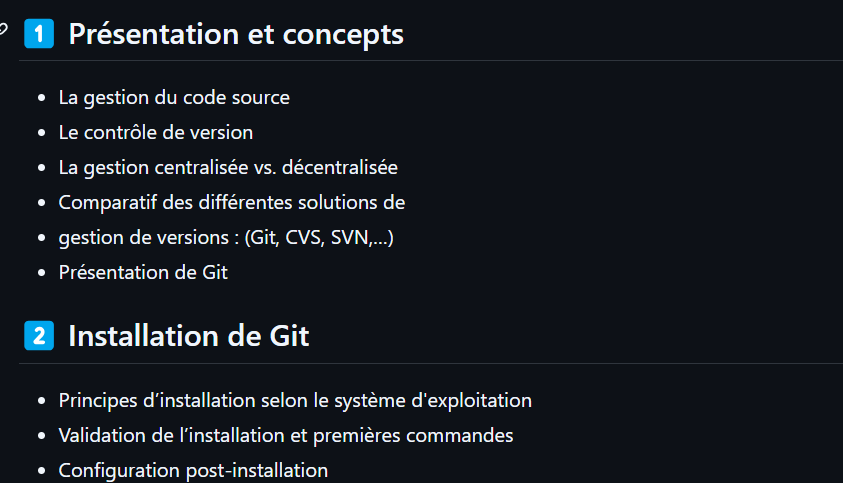

# page html

[Yndral-c.github](https://yndral-c.github.io/formation-git/)

# Apprendre à utiliser GitHub


# Utiliser EMMET

file > preferences > settings

# commande terminal

afficher la liste des fichiers et répertoires

```
dir
```


# A retenir ABSOLUMENT sur GitHub

1) Initialiser un projet git
```
git init
```

2) Définir la branche main
```
git branch -M main
```

3) Je précise mon dépot sur GitHub
```
git remote add origin http[...] 
```

4) Staging
```
git add .
```

5) Commit
```
git commit -m "First Commit"
```

6) Push le(s) commit(s)
```
git push -u origin main
```

# Introduction de nouvelles branchs

Récupérer la dernière version
```
git checkout
```

# Visualiser les différences dans l'historique

- Les différences entre le répertoire de travail et la zone d'index
```
git diff
```
- Les différences entre la zone d'index et le dernier commit
```
git diff--cached
```
- Les différences entre le répertoire de travail et le dernier commit
```
git diff HEAD
```
- Les différences mot à mot
```
git diff--word-diff
```
- Les différences lettre à lettre
```
git diff--color-words=.
```
- Les différences entre le dernier commit et l'avant dernier
```
git diff HEAD^ HEAD
```

# Supprimer des changements
- Checkout
    ```
    git checkout <fichier/branche/commit>
    ```
    - Récupérer la dernière version (depuis le dépôt) : un fichier / un commit / une branche
- Il est possible d'indiquer un numéro de révision pour restaurer le fichier à une 
version antérieure : 
    ```
    git checkout <numero> -- <fichier/branche/commit>
    ```
- Reset
    - Suppression effective !
- Exemple : Annuler les 2 derniers commits
    ```
    git reset --soft HEAD~2
    ```
    - Les modifications sont laissées dans l'index.
    ```
    git reset --mixed HEAD~2
    ```
    - Les modifications sont supprimées de l'index mais sont conservées dans le répertoire de 
travail (comportement par défaut).
    ```
    git reset --hard HEAD~2
    ```
    - Les modifications sont supprimées de l'index ET du répertoire de travail

# Les commandes de l'historique


# Ignorer des fichiers

Il est possible d’exclure des fichiers du contrôle de version Git.
    - Fichiers de préférences d’IDE, résultats de build,…
- Ajouter un fichier <code>.gitignore</code> à la racine du projet.
    - Ce fichier contient des motifs de spécification de fichiers/répertoires.
    - Règles : 
        - Les lignes vides ou commençant par # sont ignorées.
        - Les motifs d’expression des shells sont utilisables (caractères joker).
        - Les motifs se terminant par un / indiquent des répertoires.
        - Les motifs commençant par ! indiquent des éléments à inclure malgré les autres 
motifs précédents.
- Supprimer du dépôt un fichier ignoré après un push : 
```
git rm--cached /build-r
```

# Exemple de fichier .gitignore
```
fichier <code>.gitignore</code>
```

# Travailler avec les branches
- Les commandes <code>git branch</code> et <code>git checkout</code> permettent de travailler avec les 
branches.
- Lister les branches existantes :
```
git branch
```
    - La branche courante est indiquée avec *
- Créer une branche :
```
git branch <nom de la branche>
```
- Changer de branche : 
```
git checkout <nom de la branche>
```
- Créer une branche et se positionner dessus : 
```
git checkout–b <nom de la branche>
```
- Renommer la branche courante : 
```
git branch–m <nouveau nom>
```
- Renommer une branche :
```
git branch–m <ancien nom> <nouveau nom>
```